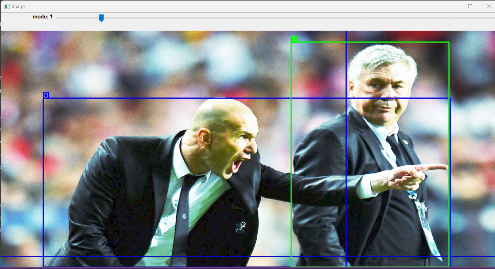

[**English**](readme.md) | **简体中文**

# 检测标注工具

该工具旨在提供一种简单高效的图像标注解决方案，适用于 YOLO 格式的目标检测任务。


只需使用 `opencv` 包，即可轻松分发，方便 PyInstaller 打包和分发。

## 简介

LabelDet 是一款图像标注工具，旨在简化和加速使用 YOLO 格式进行图像标注的过程。使用该工具，用户可以轻松在图像上绘制标注框，编辑并保存标注数据。

### 功能概述

- **标注框编辑**：支持对已绘制的标注框进行分类和删除。
- **缩放和平移**：支持图像缩放和平移，以便进行精确标注。
- **标注保存**：允许将标注数据保存为 YOLO 格式的文本文件。
- **视觉模式**：提供多种图像增强模式，以便更好地识别目标并进行标注。
- **进度归档**：可以归档进度，方便随时关闭和恢复进度。

该工具提供多种视觉模式来辅助标注，可通过 `mode` 滑块进行选择：

- **模式 1**：直方图均衡化
- **模式 2/3**：对比度增强
- **模式 4**：降低对比度
- **模式 5**：抗曝光处理
- **模式 6**：幂律变换


## 打包命令

```bash
pyinstaller -F --version-file version.txt detect_label.py
```
